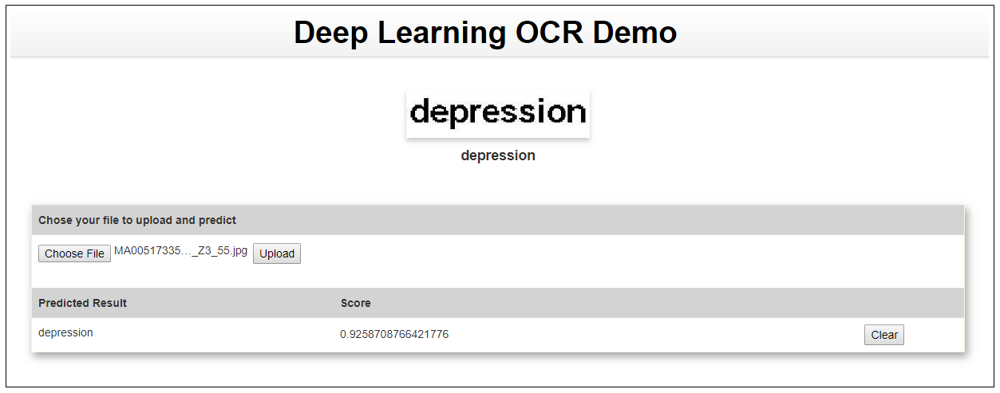

# Modern OCR using deep learning
Please find the orginal implementation at [CRNN_Tensorflow](https://github.com/MaybeShewill-CV/CRNN_Tensorflow). I have made some changes to support all ascii characters and output a confidence score for each recognized word.
The model uses a CRNN architecure which includes a CNN, LSTM and CTC loss.The whole project is wrapped up end to end as a web seloution.

## Dataset
I have trained the model on my collection of data from pdfs. There are othere available datasets online like [Synth 90k](http://www.robots.ox.ac.uk/~vgg/data/text/). I have also generated a lot of syntetic data using [Text-genrator](https://github.com/Belval/TextRecognitionDataGenerator).

## How to train
1. Collect as much data as possible, put them in dataset/Train, dataset/Test directories. Include a text file sample.txt in   which each row contains an image name and its label
2. Run tools/write_text_features.py to generate tfrecords for training, validation and testing. All the images will be resized to 100*32
```
 python tools/write_text_features.py
 ```
3. Run training script
```
 python tools/train_shadownet.py
 ```

## Result


## References
1. Orginal CRNN paper:http://arxiv.org/abs/1507.05717.
2. CRNN implementation: https://github.com/bgshih/crnn
3. Data generation: https://github.com/Belval/TextRecognitionDataGenerator
